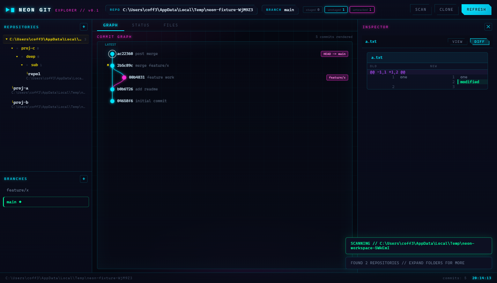
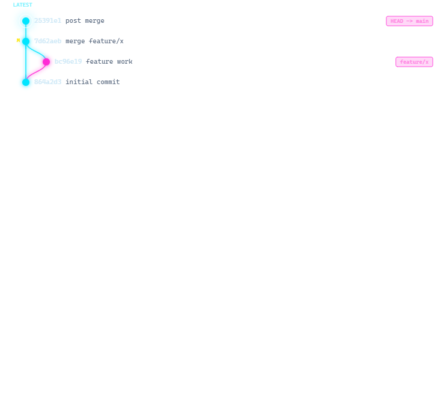
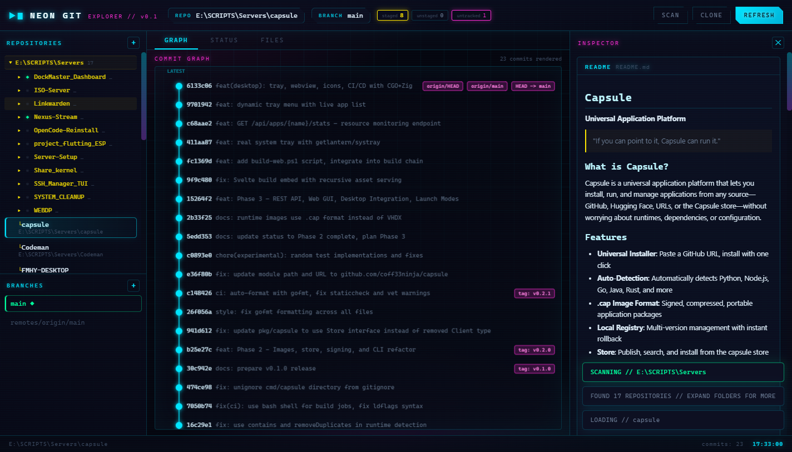

# NEON // GIT EXPLORER

A futuristic git repository explorer with a cyber neon HUD interface. Built with Electron.

## Screenshots







## Features

- Scan any folder for git repositories and add them to the sidebar
- Workspace management: expand nested folders to surface deeper repos
- Git-attribute badges: folders with a `.git` directory show a special marker, even when the repo metadata is broken — plain folders stay unmarked
- Commit graph rendered on canvas with branch LEDs
- Branch management (checkout, create, delete)
- File tree, diff viewer, and README preview
- Clone and link repositories
- Neon HUD theme with boot animation

## Requirements

- Node.js 18+
- Git on PATH

## Install

```
npm install
```

## Run

```
npm start
```

Run the smoke test (also regenerates the screenshots in `docs/`):

```
npx electron . --smoke
```

## Build

```
npm run build            # NSIS installer + portable
npm run build:portable   # portable exe only
npm run build:installer  # NSIS installer only
```

## Test

```
npm test
```

## License

MIT
